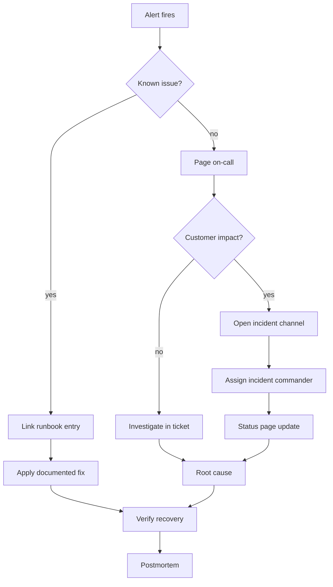

We have this flowchart in our incident-response runbook as Mermaid and it renders badly. Redraw it as a proper diagram for the docs page (doc-inline), same content:

```mermaid
flowchart TD
  A[Alert fires] --> B{Known issue?}
  B -- yes --> C[Link runbook entry]
  B -- no --> D[Page on-call]
  C --> E[Apply documented fix]
  D --> F{Customer impact?}
  F -- yes --> G[Open incident channel]
  F -- no --> H[Investigate in ticket]
  G --> I[Assign incident commander]
  I --> J[Status page update]
  H --> K[Root cause]
  J --> K
  E --> L[Verify recovery]
  K --> L
  L --> M[Postmortem]
```
